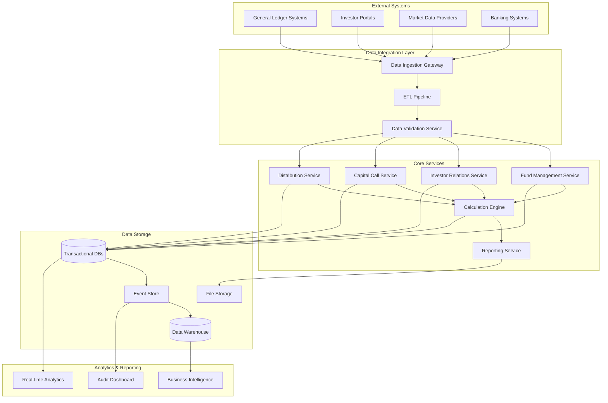
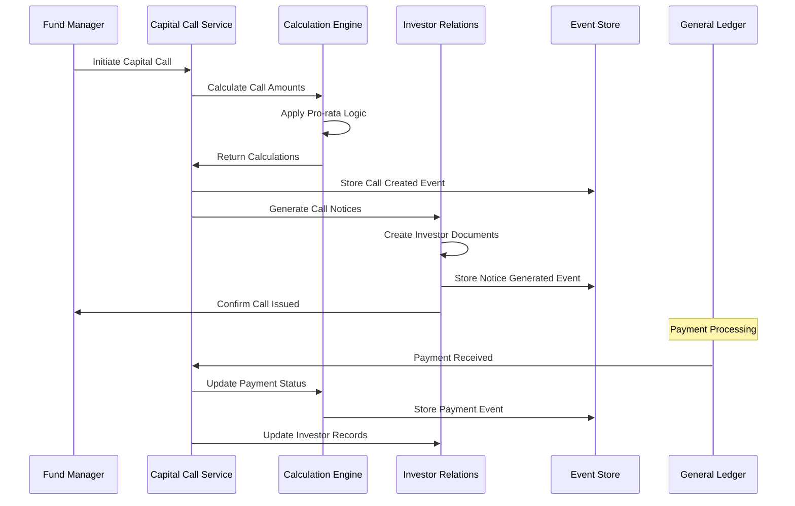
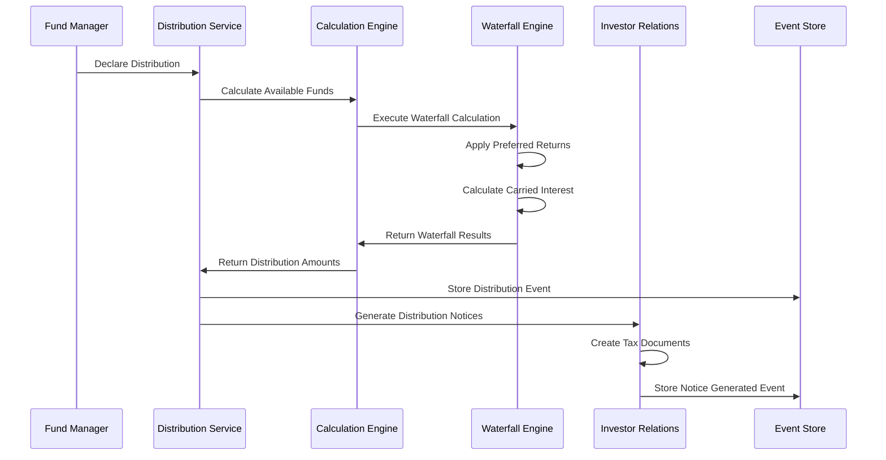

# StratCap Fund Management Platform - Data Architecture

## Table of Contents
1. [Data Modeling Approach](#1-data-modeling-approach)
2. [Database Schema Design](#2-database-schema-design)
3. [Data Flow Diagrams](#3-data-flow-diagrams)
4. [Data Integration Patterns](#4-data-integration-patterns)
5. [Data Warehouse/Analytics Design](#5-data-warehouseanalytics-design)
6. [Event Sourcing and Audit Trail](#6-event-sourcing-and-audit-trail)
7. [Data Validation and Integrity Rules](#7-data-validation-and-integrity-rules)
8. [Backup and Disaster Recovery](#8-backup-and-disaster-recovery)
9. [Data Retention and Archival Policies](#9-data-retention-and-archival-policies)
10. [Performance Optimization Strategies](#10-performance-optimization-strategies)

---

## 1. Data Modeling Approach

### 1.1 Core Financial Entity Models

#### Fund Entity Model
```sql
-- Fund aggregate root
CREATE TABLE funds (
    fund_id UUID PRIMARY KEY,
    fund_name VARCHAR(255) NOT NULL,
    fund_type VARCHAR(50) NOT NULL, -- PE, VC, HF, etc.
    fund_size DECIMAL(20,2),
    base_currency VARCHAR(3) NOT NULL,
    inception_date DATE NOT NULL,
    target_close_date DATE,
    final_close_date DATE,
    fund_status VARCHAR(20) NOT NULL, -- FUNDRAISING, ACTIVE, CLOSED, LIQUIDATED
    management_fee_rate DECIMAL(5,4),
    carried_interest_rate DECIMAL(5,4),
    hurdle_rate DECIMAL(5,4),
    catch_up_provision BOOLEAN DEFAULT FALSE,
    created_at TIMESTAMP DEFAULT CURRENT_TIMESTAMP,
    updated_at TIMESTAMP DEFAULT CURRENT_TIMESTAMP,
    version INTEGER DEFAULT 1
);

-- Fund terms and agreements
CREATE TABLE fund_terms (
    term_id UUID PRIMARY KEY,
    fund_id UUID REFERENCES funds(fund_id),
    term_type VARCHAR(50) NOT NULL, -- WATERFALL, FEE_STRUCTURE, DISTRIBUTION
    term_name VARCHAR(255) NOT NULL,
    term_value JSONB NOT NULL,
    effective_date DATE NOT NULL,
    expiry_date DATE,
    created_at TIMESTAMP DEFAULT CURRENT_TIMESTAMP
);
```

#### Investor Entity Model
```sql
-- Investor aggregate root
CREATE TABLE investors (
    investor_id UUID PRIMARY KEY,
    investor_name VARCHAR(255) NOT NULL,
    investor_type VARCHAR(50) NOT NULL, -- INSTITUTION, INDIVIDUAL, ENDOWMENT
    tax_id VARCHAR(50),
    jurisdiction VARCHAR(100),
    contact_person VARCHAR(255),
    email VARCHAR(255),
    phone VARCHAR(50),
    address JSONB,
    kyc_status VARCHAR(20) NOT NULL, -- PENDING, APPROVED, REJECTED
    kyc_date DATE,
    created_at TIMESTAMP DEFAULT CURRENT_TIMESTAMP,
    updated_at TIMESTAMP DEFAULT CURRENT_TIMESTAMP,
    version INTEGER DEFAULT 1
);

-- Investor banking details
CREATE TABLE investor_banking (
    banking_id UUID PRIMARY KEY,
    investor_id UUID REFERENCES investors(investor_id),
    bank_name VARCHAR(255) NOT NULL,
    account_number VARCHAR(100) NOT NULL,
    routing_number VARCHAR(50),
    swift_code VARCHAR(20),
    iban VARCHAR(50),
    is_primary BOOLEAN DEFAULT FALSE,
    created_at TIMESTAMP DEFAULT CURRENT_TIMESTAMP
);
```

#### Commitment Entity Model
```sql
-- Investor commitments to funds
CREATE TABLE commitments (
    commitment_id UUID PRIMARY KEY,
    fund_id UUID REFERENCES funds(fund_id),
    investor_id UUID REFERENCES investors(investor_id),
    commitment_amount DECIMAL(20,2) NOT NULL,
    commitment_date DATE NOT NULL,
    commitment_type VARCHAR(50) NOT NULL, -- INITIAL, ADDITIONAL, TRANSFER
    side_letter_terms JSONB,
    status VARCHAR(20) NOT NULL, -- ACTIVE, CANCELLED, TRANSFERRED
    created_at TIMESTAMP DEFAULT CURRENT_TIMESTAMP,
    updated_at TIMESTAMP DEFAULT CURRENT_TIMESTAMP,
    version INTEGER DEFAULT 1,
    UNIQUE(fund_id, investor_id, commitment_date)
);

-- Commitment modifications and transfers
CREATE TABLE commitment_modifications (
    modification_id UUID PRIMARY KEY,
    commitment_id UUID REFERENCES commitments(commitment_id),
    modification_type VARCHAR(50) NOT NULL, -- INCREASE, DECREASE, TRANSFER
    old_amount DECIMAL(20,2),
    new_amount DECIMAL(20,2),
    effective_date DATE NOT NULL,
    reason TEXT,
    created_at TIMESTAMP DEFAULT CURRENT_TIMESTAMP
);
```

#### Capital Call Entity Model
```sql
-- Capital calls issued to investors
CREATE TABLE capital_calls (
    call_id UUID PRIMARY KEY,
    fund_id UUID REFERENCES funds(fund_id),
    call_number INTEGER NOT NULL,
    call_date DATE NOT NULL,
    due_date DATE NOT NULL,
    call_purpose TEXT NOT NULL,
    total_call_amount DECIMAL(20,2) NOT NULL,
    call_status VARCHAR(20) NOT NULL, -- DRAFT, ISSUED, SETTLED, CANCELLED
    created_at TIMESTAMP DEFAULT CURRENT_TIMESTAMP,
    updated_at TIMESTAMP DEFAULT CURRENT_TIMESTAMP,
    version INTEGER DEFAULT 1,
    UNIQUE(fund_id, call_number)
);

-- Individual investor capital call notices
CREATE TABLE capital_call_notices (
    notice_id UUID PRIMARY KEY,
    call_id UUID REFERENCES capital_calls(call_id),
    commitment_id UUID REFERENCES commitments(commitment_id),
    call_amount DECIMAL(20,2) NOT NULL,
    percentage_called DECIMAL(5,4) NOT NULL,
    management_fee_portion DECIMAL(20,2) DEFAULT 0,
    investment_portion DECIMAL(20,2) DEFAULT 0,
    expenses_portion DECIMAL(20,2) DEFAULT 0,
    notice_status VARCHAR(20) NOT NULL, -- PENDING, PAID, OVERDUE, DEFAULTED
    payment_date DATE,
    created_at TIMESTAMP DEFAULT CURRENT_TIMESTAMP
);
```

#### Distribution Entity Model
```sql
-- Fund distributions
CREATE TABLE distributions (
    distribution_id UUID PRIMARY KEY,
    fund_id UUID REFERENCES funds(fund_id),
    distribution_number INTEGER NOT NULL,
    distribution_date DATE NOT NULL,
    record_date DATE NOT NULL,
    distribution_type VARCHAR(50) NOT NULL, -- INCOME, CAPITAL, RETURN_OF_CAPITAL
    total_distribution_amount DECIMAL(20,2) NOT NULL,
    distribution_status VARCHAR(20) NOT NULL, -- DECLARED, PAID, CANCELLED
    created_at TIMESTAMP DEFAULT CURRENT_TIMESTAMP,
    updated_at TIMESTAMP DEFAULT CURRENT_TIMESTAMP,
    version INTEGER DEFAULT 1,
    UNIQUE(fund_id, distribution_number)
);

-- Individual investor distributions
CREATE TABLE distribution_notices (
    notice_id UUID PRIMARY KEY,
    distribution_id UUID REFERENCES distributions(distribution_id),
    commitment_id UUID REFERENCES commitments(commitment_id),
    gross_distribution DECIMAL(20,2) NOT NULL,
    management_fee_offset DECIMAL(20,2) DEFAULT 0,
    carried_interest DECIMAL(20,2) DEFAULT 0,
    net_distribution DECIMAL(20,2) NOT NULL,
    tax_withholding DECIMAL(20,2) DEFAULT 0,
    notice_status VARCHAR(20) NOT NULL, -- PENDING, PAID, CANCELLED
    payment_date DATE,
    created_at TIMESTAMP DEFAULT CURRENT_TIMESTAMP
);
```

### 1.2 Domain-Driven Design Principles

- **Bounded Contexts**: Each microservice represents a distinct bounded context
- **Aggregates**: Fund, Investor, Commitment, Capital Call, Distribution as aggregate roots
- **Value Objects**: Money, Address, Contact Info as immutable value objects
- **Event Sourcing**: All state changes captured as domain events
- **CQRS**: Separate read and write models for optimal performance

---

## 2. Database Schema Design

### 2.1 Microservice Database Schemas

#### Fund Management Service
```sql
-- Fund portfolio and investment tracking
CREATE TABLE investments (
    investment_id UUID PRIMARY KEY,
    fund_id UUID REFERENCES funds(fund_id),
    portfolio_company VARCHAR(255) NOT NULL,
    investment_date DATE NOT NULL,
    investment_amount DECIMAL(20,2) NOT NULL,
    investment_type VARCHAR(50) NOT NULL, -- EQUITY, DEBT, CONVERTIBLE
    valuation_method VARCHAR(50),
    current_fair_value DECIMAL(20,2),
    last_valuation_date DATE,
    investment_status VARCHAR(20) NOT NULL, -- ACTIVE, REALIZED, WRITTEN_OFF
    created_at TIMESTAMP DEFAULT CURRENT_TIMESTAMP,
    updated_at TIMESTAMP DEFAULT CURRENT_TIMESTAMP
);

-- Investment valuations history
CREATE TABLE investment_valuations (
    valuation_id UUID PRIMARY KEY,
    investment_id UUID REFERENCES investments(investment_id),
    valuation_date DATE NOT NULL,
    fair_value DECIMAL(20,2) NOT NULL,
    valuation_method VARCHAR(50) NOT NULL,
    valuation_source VARCHAR(100),
    unrealized_gain_loss DECIMAL(20,2),
    notes TEXT,
    created_at TIMESTAMP DEFAULT CURRENT_TIMESTAMP
);
```

#### Investor Relations Service
```sql
-- Investor communications and documents
CREATE TABLE investor_communications (
    communication_id UUID PRIMARY KEY,
    investor_id UUID REFERENCES investors(investor_id),
    fund_id UUID REFERENCES funds(fund_id),
    communication_type VARCHAR(50) NOT NULL, -- EMAIL, LETTER, REPORT
    subject VARCHAR(255),
    content TEXT,
    sent_date TIMESTAMP,
    delivery_status VARCHAR(20) NOT NULL, -- SENT, DELIVERED, FAILED
    created_at TIMESTAMP DEFAULT CURRENT_TIMESTAMP
);

-- Investor documents and statements
CREATE TABLE investor_documents (
    document_id UUID PRIMARY KEY,
    investor_id UUID REFERENCES investors(investor_id),
    fund_id UUID REFERENCES funds(fund_id),
    document_type VARCHAR(50) NOT NULL, -- STATEMENT, REPORT, NOTICE
    document_name VARCHAR(255) NOT NULL,
    document_path VARCHAR(500),
    document_size BIGINT,
    mime_type VARCHAR(100),
    generated_date TIMESTAMP,
    created_at TIMESTAMP DEFAULT CURRENT_TIMESTAMP
);
```

#### Calculation Engine Service
```sql
-- Waterfall calculation configurations
CREATE TABLE waterfall_configs (
    config_id UUID PRIMARY KEY,
    fund_id UUID REFERENCES funds(fund_id),
    waterfall_name VARCHAR(255) NOT NULL,
    waterfall_structure JSONB NOT NULL,
    effective_date DATE NOT NULL,
    is_active BOOLEAN DEFAULT TRUE,
    created_at TIMESTAMP DEFAULT CURRENT_TIMESTAMP
);

-- Calculation results and audit trail
CREATE TABLE calculation_results (
    result_id UUID PRIMARY KEY,
    calculation_type VARCHAR(50) NOT NULL, -- WATERFALL, FEE, NAV
    fund_id UUID REFERENCES funds(fund_id),
    calculation_date DATE NOT NULL,
    input_parameters JSONB NOT NULL,
    calculation_result JSONB NOT NULL,
    calculation_status VARCHAR(20) NOT NULL, -- PENDING, COMPLETED, FAILED
    created_at TIMESTAMP DEFAULT CURRENT_TIMESTAMP,
    completed_at TIMESTAMP
);
```

#### Reporting Service
```sql
-- Report definitions and templates
CREATE TABLE report_templates (
    template_id UUID PRIMARY KEY,
    template_name VARCHAR(255) NOT NULL,
    template_type VARCHAR(50) NOT NULL, -- INVESTOR_STATEMENT, PERFORMANCE, COMPLIANCE
    template_definition JSONB NOT NULL,
    is_active BOOLEAN DEFAULT TRUE,
    created_by UUID,
    created_at TIMESTAMP DEFAULT CURRENT_TIMESTAMP,
    updated_at TIMESTAMP DEFAULT CURRENT_TIMESTAMP
);

-- Generated reports tracking
CREATE TABLE generated_reports (
    report_id UUID PRIMARY KEY,
    template_id UUID REFERENCES report_templates(template_id),
    fund_id UUID REFERENCES funds(fund_id),
    report_parameters JSONB,
    report_data JSONB,
    report_status VARCHAR(20) NOT NULL, -- GENERATING, COMPLETED, FAILED
    file_path VARCHAR(500),
    generated_by UUID,
    generated_at TIMESTAMP DEFAULT CURRENT_TIMESTAMP
);
```

### 2.2 Reference Data and Configuration

```sql
-- System configuration
CREATE TABLE system_configurations (
    config_id UUID PRIMARY KEY,
    config_key VARCHAR(255) NOT NULL UNIQUE,
    config_value JSONB NOT NULL,
    config_type VARCHAR(50) NOT NULL, -- GLOBAL, TENANT, USER
    tenant_id UUID,
    is_active BOOLEAN DEFAULT TRUE,
    created_at TIMESTAMP DEFAULT CURRENT_TIMESTAMP,
    updated_at TIMESTAMP DEFAULT CURRENT_TIMESTAMP
);

-- Currency exchange rates
CREATE TABLE exchange_rates (
    rate_id UUID PRIMARY KEY,
    base_currency VARCHAR(3) NOT NULL,
    target_currency VARCHAR(3) NOT NULL,
    exchange_rate DECIMAL(15,8) NOT NULL,
    rate_date DATE NOT NULL,
    rate_source VARCHAR(100),
    created_at TIMESTAMP DEFAULT CURRENT_TIMESTAMP,
    UNIQUE(base_currency, target_currency, rate_date)
);

-- Chart of accounts
CREATE TABLE chart_of_accounts (
    account_id UUID PRIMARY KEY,
    account_code VARCHAR(50) NOT NULL,
    account_name VARCHAR(255) NOT NULL,
    account_type VARCHAR(50) NOT NULL, -- ASSET, LIABILITY, EQUITY, REVENUE, EXPENSE
    parent_account_id UUID REFERENCES chart_of_accounts(account_id),
    is_active BOOLEAN DEFAULT TRUE,
    created_at TIMESTAMP DEFAULT CURRENT_TIMESTAMP
);
```

---

## 3. Data Flow Diagrams

### 3.1 High-Level Data Flow Architecture



### 3.2 Capital Call Data Flow



### 3.3 Distribution Data Flow



---

## 4. Data Integration Patterns

### 4.1 General Ledger Integration

#### Pattern: Extract, Transform, Load (ETL) with Change Data Capture

```python
# GL Integration Service
class GLIntegrationService:
    def __init__(self, gl_connector, transformation_engine, audit_logger):
        self.gl_connector = gl_connector
        self.transformation_engine = transformation_engine
        self.audit_logger = audit_logger
    
    async def sync_gl_data(self, fund_id: str, sync_type: str = "incremental"):
        """
        Synchronize GL data with configurable transformation rules
        """
        try:
            # Extract data from GL system
            gl_data = await self.gl_connector.extract_data(
                fund_id=fund_id,
                sync_type=sync_type,
                last_sync_timestamp=self.get_last_sync_timestamp(fund_id)
            )
            
            # Transform data using configurable rules
            transformed_data = await self.transformation_engine.transform(
                source_data=gl_data,
                transformation_rules=self.get_transformation_rules(fund_id)
            )
            
            # Validate data integrity
            validation_results = await self.validate_data(transformed_data)
            
            if validation_results.is_valid:
                # Load data into target system
                await self.load_data(transformed_data)
                
                # Log successful sync
                await self.audit_logger.log_sync_success(
                    fund_id=fund_id,
                    records_processed=len(transformed_data),
                    sync_timestamp=datetime.utcnow()
                )
            else:
                # Handle validation failures
                await self.handle_validation_failures(validation_results)
                
        except Exception as e:
            await self.audit_logger.log_sync_error(fund_id, str(e))
            raise
```

#### Transformation Rules Configuration

```sql
-- GL mapping configurations
CREATE TABLE gl_mapping_rules (
    rule_id UUID PRIMARY KEY,
    fund_id UUID REFERENCES funds(fund_id),
    gl_system_type VARCHAR(50) NOT NULL, -- SAGE, QUICKBOOKS, SAP, ORACLE
    source_field VARCHAR(255) NOT NULL,
    target_field VARCHAR(255) NOT NULL,
    transformation_logic JSONB, -- Custom transformation rules
    is_active BOOLEAN DEFAULT TRUE,
    created_at TIMESTAMP DEFAULT CURRENT_TIMESTAMP
);

-- GL account mappings
CREATE TABLE gl_account_mappings (
    mapping_id UUID PRIMARY KEY,
    fund_id UUID REFERENCES funds(fund_id),
    gl_account_code VARCHAR(50) NOT NULL,
    stratcap_account_id UUID REFERENCES chart_of_accounts(account_id),
    mapping_type VARCHAR(50) NOT NULL, -- DIRECT, AGGREGATED, CALCULATED
    mapping_rules JSONB,
    created_at TIMESTAMP DEFAULT CURRENT_TIMESTAMP
);
```

### 4.2 Investor Portal Integration

#### Pattern: API Gateway with Standardized Adapters

```python
# Investor Portal Integration Framework
class InvestorPortalAdapter:
    """Abstract base class for investor portal integrations"""
    
    async def authenticate(self, credentials: dict) -> str:
        """Authenticate with investor portal"""
        raise NotImplementedError
    
    async def fetch_investor_data(self, investor_id: str) -> dict:
        """Fetch investor information"""
        raise NotImplementedError
    
    async def update_investor_data(self, investor_id: str, data: dict) -> bool:
        """Update investor information"""
        raise NotImplementedError
    
    async def get_commitment_status(self, commitment_id: str) -> dict:
        """Get commitment status from portal"""
        raise NotImplementedError

# Specific portal implementations
class AltsPortalAdapter(InvestorPortalAdapter):
    """Adapter for Alts.co portal integration"""
    
    async def fetch_investor_data(self, investor_id: str) -> dict:
        # Implementation specific to Alts.co API
        pass

class iCapitalAdapter(InvestorPortalAdapter):
    """Adapter for iCapital portal integration"""
    
    async def fetch_investor_data(self, investor_id: str) -> dict:
        # Implementation specific to iCapital API
        pass
```

### 4.3 Data Synchronization Patterns

#### Event-Driven Synchronization

```python
# Event-driven data synchronization
class DataSyncOrchestrator:
    def __init__(self, event_bus, sync_handlers):
        self.event_bus = event_bus
        self.sync_handlers = sync_handlers
    
    async def handle_data_change_event(self, event: DataChangeEvent):
        """Handle data change events and trigger appropriate sync"""
        
        sync_tasks = []
        
        # Determine which systems need to be synchronized
        for handler in self.sync_handlers:
            if handler.should_sync(event):
                sync_tasks.append(handler.sync_data(event))
        
        # Execute synchronization tasks concurrently
        results = await asyncio.gather(*sync_tasks, return_exceptions=True)
        
        # Handle sync results and failures
        await self.process_sync_results(event, results)
```

---

## 5. Data Warehouse/Analytics Design

### 5.1 Star Schema Design for Fund Analytics

```sql
-- Fact Tables
CREATE TABLE fact_fund_performance (
    performance_id UUID PRIMARY KEY,
    fund_id UUID NOT NULL,
    date_id INTEGER NOT NULL,
    investor_id UUID,
    
    -- Measures
    nav DECIMAL(20,2),
    committed_capital DECIMAL(20,2),
    called_capital DECIMAL(20,2),
    distributed_capital DECIMAL(20,2),
    remaining_value DECIMAL(20,2),
    total_value DECIMAL(20,2),
    irr DECIMAL(8,4),
    moic DECIMAL(8,4),
    dpi DECIMAL(8,4),
    rvpi DECIMAL(8,4),
    tvpi DECIMAL(8,4),
    
    -- Metadata
    created_at TIMESTAMP DEFAULT CURRENT_TIMESTAMP,
    
    -- Foreign Keys
    FOREIGN KEY (fund_id) REFERENCES dim_fund(fund_id),
    FOREIGN KEY (date_id) REFERENCES dim_date(date_id),
    FOREIGN KEY (investor_id) REFERENCES dim_investor(investor_id)
);

CREATE TABLE fact_cash_flows (
    cash_flow_id UUID PRIMARY KEY,
    fund_id UUID NOT NULL,
    investor_id UUID NOT NULL,
    date_id INTEGER NOT NULL,
    
    -- Measures
    capital_call_amount DECIMAL(20,2) DEFAULT 0,
    distribution_amount DECIMAL(20,2) DEFAULT 0,
    net_cash_flow DECIMAL(20,2) DEFAULT 0,
    
    -- Attributes
    cash_flow_type VARCHAR(50) NOT NULL, -- CAPITAL_CALL, DISTRIBUTION, FEE
    transaction_id UUID,
    
    created_at TIMESTAMP DEFAULT CURRENT_TIMESTAMP,
    
    FOREIGN KEY (fund_id) REFERENCES dim_fund(fund_id),
    FOREIGN KEY (investor_id) REFERENCES dim_investor(investor_id),
    FOREIGN KEY (date_id) REFERENCES dim_date(date_id)
);

-- Dimension Tables
CREATE TABLE dim_fund (
    fund_id UUID PRIMARY KEY,
    fund_name VARCHAR(255) NOT NULL,
    fund_type VARCHAR(50) NOT NULL,
    vintage_year INTEGER,
    target_size DECIMAL(20,2),
    final_size DECIMAL(20,2),
    base_currency VARCHAR(3),
    fund_manager VARCHAR(255),
    investment_strategy VARCHAR(255),
    geography VARCHAR(100),
    
    -- SCD Type 2 attributes
    valid_from DATE NOT NULL,
    valid_to DATE,
    is_current BOOLEAN DEFAULT TRUE,
    
    created_at TIMESTAMP DEFAULT CURRENT_TIMESTAMP
);

CREATE TABLE dim_investor (
    investor_id UUID PRIMARY KEY,
    investor_name VARCHAR(255) NOT NULL,
    investor_type VARCHAR(50) NOT NULL,
    investor_category VARCHAR(50), -- INSTITUTIONAL, RETAIL, ENDOWMENT
    geography VARCHAR(100),
    industry VARCHAR(100),
    aum_range VARCHAR(50),
    
    -- SCD Type 2 attributes
    valid_from DATE NOT NULL,
    valid_to DATE,
    is_current BOOLEAN DEFAULT TRUE,
    
    created_at TIMESTAMP DEFAULT CURRENT_TIMESTAMP
);

CREATE TABLE dim_date (
    date_id INTEGER PRIMARY KEY,
    date_value DATE NOT NULL,
    year INTEGER NOT NULL,
    quarter INTEGER NOT NULL,
    month INTEGER NOT NULL,
    day INTEGER NOT NULL,
    day_of_week INTEGER NOT NULL,
    day_of_year INTEGER NOT NULL,
    week_of_year INTEGER NOT NULL,
    month_name VARCHAR(20) NOT NULL,
    quarter_name VARCHAR(10) NOT NULL,
    is_weekend BOOLEAN DEFAULT FALSE,
    is_holiday BOOLEAN DEFAULT FALSE,
    fiscal_year INTEGER,
    fiscal_quarter INTEGER
);
```

### 5.2 ETL Pipeline for Data Warehouse

```python
# Data Warehouse ETL Pipeline
class DataWarehouseETL:
    def __init__(self, source_db, target_dw, transformation_rules):
        self.source_db = source_db
        self.target_dw = target_dw
        self.transformation_rules = transformation_rules
    
    async def extract_fund_data(self, fund_id: str, start_date: date, end_date: date):
        """Extract fund data from operational systems"""
        
        # Extract from multiple sources
        fund_data = await self.source_db.fetch_fund_data(fund_id, start_date, end_date)
        investor_data = await self.source_db.fetch_investor_data(fund_id)
        transaction_data = await self.source_db.fetch_transaction_data(fund_id, start_date, end_date)
        
        return {
            'fund_data': fund_data,
            'investor_data': investor_data,
            'transaction_data': transaction_data
        }
    
    async def transform_for_analytics(self, extracted_data: dict):
        """Transform data for analytics and reporting"""
        
        # Calculate performance metrics
        performance_metrics = await self.calculate_performance_metrics(
            extracted_data['fund_data'],
            extracted_data['transaction_data']
        )
        
        # Aggregate cash flows
        cash_flow_facts = await self.aggregate_cash_flows(
            extracted_data['transaction_data']
        )
        
        # Update dimension tables
        dimension_updates = await self.prepare_dimension_updates(
            extracted_data['fund_data'],
            extracted_data['investor_data']
        )
        
        return {
            'performance_facts': performance_metrics,
            'cash_flow_facts': cash_flow_facts,
            'dimension_updates': dimension_updates
        }
    
    async def load_to_warehouse(self, transformed_data: dict):
        """Load transformed data into data warehouse"""
        
        async with self.target_dw.begin() as transaction:
            # Load dimension updates first
            await self.load_dimensions(transformed_data['dimension_updates'])
            
            # Load fact tables
            await self.load_performance_facts(transformed_data['performance_facts'])
            await self.load_cash_flow_facts(transformed_data['cash_flow_facts'])
            
            # Update metadata
            await self.update_etl_metadata()
```

### 5.3 Real-time Analytics Architecture

```python
# Real-time analytics using event streaming
class RealTimeAnalytics:
    def __init__(self, event_stream, metrics_calculator, cache_manager):
        self.event_stream = event_stream
        self.metrics_calculator = metrics_calculator
        self.cache_manager = cache_manager
    
    async def process_real_time_events(self):
        """Process events for real-time analytics"""
        
        async for event in self.event_stream:
            if event.type == "CAPITAL_CALL_PAID":
                await self.update_fund_metrics(event)
            elif event.type == "DISTRIBUTION_PAID":
                await self.update_distribution_metrics(event)
            elif event.type == "INVESTMENT_VALUATION_UPDATED":
                await self.update_nav_metrics(event)
    
    async def update_fund_metrics(self, event):
        """Update real-time fund metrics"""
        
        # Calculate updated metrics
        updated_metrics = await self.metrics_calculator.calculate_fund_metrics(
            fund_id=event.fund_id,
            event_data=event.data
        )
        
        # Update cache for real-time access
        await self.cache_manager.set_fund_metrics(event.fund_id, updated_metrics)
        
        # Trigger real-time dashboard updates
        await self.notify_dashboard_update(event.fund_id, updated_metrics)
```

---

## 6. Event Sourcing and Audit Trail

### 6.1 Event Store Design

```sql
-- Event store schema
CREATE TABLE event_store (
    event_id UUID PRIMARY KEY,
    aggregate_id UUID NOT NULL,
    aggregate_type VARCHAR(100) NOT NULL,
    event_type VARCHAR(100) NOT NULL,
    event_version INTEGER NOT NULL,
    event_data JSONB NOT NULL,
    metadata JSONB,
    occurred_at TIMESTAMP NOT NULL DEFAULT CURRENT_TIMESTAMP,
    created_at TIMESTAMP NOT NULL DEFAULT CURRENT_TIMESTAMP,
    
    -- Ensure event ordering
    UNIQUE(aggregate_id, event_version)
);

-- Event store indexes
CREATE INDEX idx_event_store_aggregate ON event_store(aggregate_id, event_version);
CREATE INDEX idx_event_store_type ON event_store(aggregate_type, event_type);
CREATE INDEX idx_event_store_occurred ON event_store(occurred_at);

-- Event snapshots for performance
CREATE TABLE event_snapshots (
    snapshot_id UUID PRIMARY KEY,
    aggregate_id UUID NOT NULL,
    aggregate_type VARCHAR(100) NOT NULL,
    snapshot_version INTEGER NOT NULL,
    snapshot_data JSONB NOT NULL,
    created_at TIMESTAMP NOT NULL DEFAULT CURRENT_TIMESTAMP,
    
    UNIQUE(aggregate_id, snapshot_version)
);
```

### 6.2 Event Sourcing Implementation

```python
# Event sourcing framework
class EventStore:
    def __init__(self, database_connection):
        self.db = database_connection
    
    async def append_events(self, aggregate_id: str, events: List[DomainEvent], expected_version: int):
        """Append events to the event store"""
        
        async with self.db.begin() as transaction:
            # Check for concurrency conflicts
            current_version = await self.get_current_version(aggregate_id)
            
            if current_version != expected_version:
                raise ConcurrencyError(f"Expected version {expected_version}, but current version is {current_version}")
            
            # Append events
            for i, event in enumerate(events):
                await transaction.execute(
                    """
                    INSERT INTO event_store (
                        event_id, aggregate_id, aggregate_type, event_type,
                        event_version, event_data, metadata, occurred_at
                    ) VALUES ($1, $2, $3, $4, $5, $6, $7, $8)
                    """,
                    event.event_id,
                    aggregate_id,
                    event.aggregate_type,
                    event.event_type,
                    expected_version + i + 1,
                    event.to_json(),
                    event.metadata,
                    event.occurred_at
                )
    
    async def get_events(self, aggregate_id: str, from_version: int = 0) -> List[DomainEvent]:
        """Retrieve events for an aggregate"""
        
        rows = await self.db.fetch(
            """
            SELECT event_type, event_data, metadata, occurred_at
            FROM event_store
            WHERE aggregate_id = $1 AND event_version > $2
            ORDER BY event_version
            """,
            aggregate_id, from_version
        )
        
        return [self.deserialize_event(row) for row in rows]

# Domain events
class DomainEvent:
    def __init__(self, aggregate_id: str, event_type: str, event_data: dict, metadata: dict = None):
        self.event_id = str(uuid.uuid4())
        self.aggregate_id = aggregate_id
        self.event_type = event_type
        self.event_data = event_data
        self.metadata = metadata or {}
        self.occurred_at = datetime.utcnow()
    
    def to_json(self) -> dict:
        return {
            'event_id': self.event_id,
            'aggregate_id': self.aggregate_id,
            'event_type': self.event_type,
            'event_data': self.event_data,
            'occurred_at': self.occurred_at.isoformat()
        }

# Specific domain events
class CapitalCallCreatedEvent(DomainEvent):
    def __init__(self, fund_id: str, call_data: dict):
        super().__init__(
            aggregate_id=fund_id,
            event_type="CAPITAL_CALL_CREATED",
            event_data=call_data
        )

class DistributionDeclaredEvent(DomainEvent):
    def __init__(self, fund_id: str, distribution_data: dict):
        super().__init__(
            aggregate_id=fund_id,
            event_type="DISTRIBUTION_DECLARED",
            event_data=distribution_data
        )
```

### 6.3 Audit Trail Implementation

```sql
-- Comprehensive audit trail
CREATE TABLE audit_trail (
    audit_id UUID PRIMARY KEY,
    entity_type VARCHAR(100) NOT NULL,
    entity_id UUID NOT NULL,
    action_type VARCHAR(50) NOT NULL, -- CREATE, UPDATE, DELETE, VIEW
    user_id UUID NOT NULL,
    user_role VARCHAR(50),
    ip_address INET,
    user_agent TEXT,
    session_id VARCHAR(255),
    
    -- Change tracking
    field_changes JSONB, -- Old and new values
    reason TEXT,
    
    -- Metadata
    timestamp TIMESTAMP NOT NULL DEFAULT CURRENT_TIMESTAMP,
    correlation_id UUID, -- For tracing related actions
    
    -- Compliance
    data_classification VARCHAR(50), -- PUBLIC, INTERNAL, CONFIDENTIAL, RESTRICTED
    retention_period INTEGER -- Days to retain audit record
);

-- Audit trail indexes
CREATE INDEX idx_audit_entity ON audit_trail(entity_type, entity_id);
CREATE INDEX idx_audit_user ON audit_trail(user_id, timestamp);
CREATE INDEX idx_audit_timestamp ON audit_trail(timestamp);
CREATE INDEX idx_audit_correlation ON audit_trail(correlation_id);
```

```python
# Audit trail service
class AuditTrailService:
    def __init__(self, database_connection, user_context):
        self.db = database_connection
        self.user_context = user_context
    
    async def log_action(self, entity_type: str, entity_id: str, action_type: str, 
                        field_changes: dict = None, reason: str = None):
        """Log user action for audit trail"""
        
        audit_record = {
            'audit_id': str(uuid.uuid4()),
            'entity_type': entity_type,
            'entity_id': entity_id,
            'action_type': action_type,
            'user_id': self.user_context.user_id,
            'user_role': self.user_context.role,
            'ip_address': self.user_context.ip_address,
            'user_agent': self.user_context.user_agent,
            'session_id': self.user_context.session_id,
            'field_changes': field_changes,
            'reason': reason,
            'correlation_id': self.user_context.correlation_id,
            'data_classification': self.get_data_classification(entity_type),
            'retention_period': self.get_retention_period(entity_type)
        }
        
        await self.db.execute(
            """
            INSERT INTO audit_trail (
                audit_id, entity_type, entity_id, action_type, user_id,
                user_role, ip_address, user_agent, session_id,
                field_changes, reason, correlation_id,
                data_classification, retention_period
            ) VALUES (
                $1, $2, $3, $4, $5, $6, $7, $8, $9, $10, $11, $12, $13, $14
            )
            """,
            *audit_record.values()
        )
    
    async def get_audit_history(self, entity_type: str, entity_id: str, 
                               start_date: datetime = None, end_date: datetime = None):
        """Retrieve audit history for an entity"""
        
        query = """
            SELECT audit_id, action_type, user_id, user_role, 
                   field_changes, reason, timestamp
            FROM audit_trail
            WHERE entity_type = $1 AND entity_id = $2
        """
        
        params = [entity_type, entity_id]
        
        if start_date:
            query += " AND timestamp >= $3"
            params.append(start_date)
        
        if end_date:
            query += " AND timestamp <= $4"
            params.append(end_date)
        
        query += " ORDER BY timestamp DESC"
        
        return await self.db.fetch(query, *params)
```

---

## 7. Data Validation and Integrity Rules

### 7.1 Business Rule Validation Framework

```python
# Business rule validation framework
class ValidationRule:
    def __init__(self, rule_name: str, description: str, severity: str = "ERROR"):
        self.rule_name = rule_name
        self.description = description
        self.severity = severity  # ERROR, WARNING, INFO
    
    async def validate(self, data: dict) -> ValidationResult:
        """Override in subclasses to implement validation logic"""
        raise NotImplementedError

class ValidationResult:
    def __init__(self, is_valid: bool, rule_name: str, message: str, 
                 severity: str, data_context: dict = None):
        self.is_valid = is_valid
        self.rule_name = rule_name
        self.message = message
        self.severity = severity
        self.data_context = data_context or {}

# Fund-specific validation rules
class FundCommitmentValidationRule(ValidationRule):
    def __init__(self):
        super().__init__(
            rule_name="FUND_COMMITMENT_VALIDATION",
            description="Validate fund commitment constraints",
            severity="ERROR"
        )
    
    async def validate(self, data: dict) -> ValidationResult:
        fund_id = data.get('fund_id')
        commitment_amount = data.get('commitment_amount')
        
        # Check fund capacity
        fund_info = await self.get_fund_info(fund_id)
        total_commitments = await self.get_total_commitments(fund_id)
        
        if total_commitments + commitment_amount > fund_info.fund_size:
            return ValidationResult(
                is_valid=False,
                rule_name=self.rule_name,
                message=f"Commitment exceeds fund capacity by {total_commitments + commitment_amount - fund_info.fund_size}",
                severity=self.severity,
                data_context={
                    'fund_size': fund_info.fund_size,
                    'total_commitments': total_commitments,
                    'new_commitment': commitment_amount
                }
            )
        
        return ValidationResult(
            is_valid=True,
            rule_name=self.rule_name,
            message="Commitment validation passed",
            severity=self.severity
        )

class CapitalCallValidationRule(ValidationRule):
    def __init__(self):
        super().__init__(
            rule_name="CAPITAL_CALL_VALIDATION",
            description="Validate capital call constraints",
            severity="ERROR"
        )
    
    async def validate(self, data: dict) -> ValidationResult:
        fund_id = data.get('fund_id')
        call_amount = data.get('call_amount')
        
        # Check available commitment
        available_commitment = await self.get_available_commitment(fund_id)
        
        if call_amount > available_commitment:
            return ValidationResult(
                is_valid=False,
                rule_name=self.rule_name,
                message=f"Capital call exceeds available commitment by {call_amount - available_commitment}",
                severity=self.severity
            )
        
        return ValidationResult(
            is_valid=True,
            rule_name=self.rule_name,
            message="Capital call validation passed",
            severity=self.severity
        )

# Validation engine
class ValidationEngine:
    def __init__(self):
        self.rules = {}
    
    def register_rule(self, entity_type: str, rule: ValidationRule):
        """Register a validation rule for an entity type"""
        if entity_type not in self.rules:
            self.rules[entity_type] = []
        self.rules[entity_type].append(rule)
    
    async def validate(self, entity_type: str, data: dict) -> List[ValidationResult]:
        """Validate data against all registered rules"""
        results = []
        
        if entity_type in self.rules:
            for rule in self.rules[entity_type]:
                result = await rule.validate(data)
                results.append(result)
        
        return results
    
    def has_errors(self, results: List[ValidationResult]) -> bool:
        """Check if validation results contain errors"""
        return any(not result.is_valid and result.severity == "ERROR" for result in results)
```

### 7.2 Database Constraints and Triggers

```sql
-- Database-level constraints
ALTER TABLE commitments ADD CONSTRAINT check_commitment_amount 
    CHECK (commitment_amount > 0);

ALTER TABLE capital_calls ADD CONSTRAINT check_call_amount 
    CHECK (total_call_amount > 0);

ALTER TABLE distributions ADD CONSTRAINT check_distribution_amount 
    CHECK (total_distribution_amount > 0);

-- Referential integrity constraints
ALTER TABLE capital_call_notices ADD CONSTRAINT fk_commitment_active
    FOREIGN KEY (commitment_id) REFERENCES commitments(commitment_id)
    WHERE commitments.status = 'ACTIVE';

-- Database triggers for validation
CREATE OR REPLACE FUNCTION validate_capital_call_amount()
RETURNS TRIGGER AS $$
BEGIN
    -- Check if capital call exceeds available commitment
    IF (
        SELECT SUM(ccn.call_amount)
        FROM capital_call_notices ccn
        JOIN capital_calls cc ON ccn.call_id = cc.call_id
        WHERE ccn.commitment_id = NEW.commitment_id
          AND cc.call_status != 'CANCELLED'
    ) > (
        SELECT commitment_amount
        FROM commitments
        WHERE commitment_id = NEW.commitment_id
    ) THEN
        RAISE EXCEPTION 'Capital call exceeds available commitment';
    END IF;
    
    RETURN NEW;
END;
$$ LANGUAGE plpgsql;

CREATE TRIGGER trigger_validate_capital_call
    BEFORE INSERT OR UPDATE ON capital_call_notices
    FOR EACH ROW
    EXECUTE FUNCTION validate_capital_call_amount();

-- Waterfall calculation validation
CREATE OR REPLACE FUNCTION validate_waterfall_total()
RETURNS TRIGGER AS $$
BEGIN
    -- Ensure distribution total equals sum of investor distributions
    IF (
        SELECT SUM(net_distribution)
        FROM distribution_notices
        WHERE distribution_id = NEW.distribution_id
    ) != (
        SELECT total_distribution_amount
        FROM distributions
        WHERE distribution_id = NEW.distribution_id
    ) THEN
        RAISE EXCEPTION 'Distribution total does not match sum of investor distributions';
    END IF;
    
    RETURN NEW;
END;
$$ LANGUAGE plpgsql;

CREATE TRIGGER trigger_validate_waterfall
    AFTER INSERT OR UPDATE ON distribution_notices
    FOR EACH ROW
    EXECUTE FUNCTION validate_waterfall_total();
```

### 7.3 Data Quality Monitoring

```python
# Data quality monitoring service
class DataQualityMonitor:
    def __init__(self, database_connection, alert_service):
        self.db = database_connection
        self.alert_service = alert_service
    
    async def run_quality_checks(self):
        """Run comprehensive data quality checks"""
        
        checks = [
            self.check_commitment_consistency(),
            self.check_capital_call_reconciliation(),
            self.check_distribution_reconciliation(),
            self.check_nav_calculations(),
            self.check_duplicate_records(),
            self.check_orphaned_records()
        ]
        
        results = await asyncio.gather(*checks)
        
        # Process results and send alerts
        for result in results:
            if result.has_issues:
                await self.alert_service.send_quality_alert(result)
    
    async def check_commitment_consistency(self):
        """Check for commitment consistency issues"""
        
        query = """
            SELECT f.fund_id, f.fund_name,
                   SUM(c.commitment_amount) as total_commitments,
                   f.fund_size
            FROM funds f
            JOIN commitments c ON f.fund_id = c.fund_id
            WHERE c.status = 'ACTIVE'
            GROUP BY f.fund_id, f.fund_name, f.fund_size
            HAVING SUM(c.commitment_amount) > f.fund_size * 1.05  -- 5% tolerance
        """
        
        issues = await self.db.fetch(query)
        
        return DataQualityResult(
            check_name="COMMITMENT_CONSISTENCY",
            has_issues=len(issues) > 0,
            issues=issues
        )
    
    async def check_capital_call_reconciliation(self):
        """Check for capital call reconciliation issues"""
        
        query = """
            SELECT cc.fund_id, cc.call_id,
                   cc.total_call_amount,
                   SUM(ccn.call_amount) as sum_notices
            FROM capital_calls cc
            LEFT JOIN capital_call_notices ccn ON cc.call_id = ccn.call_id
            GROUP BY cc.fund_id, cc.call_id, cc.total_call_amount
            HAVING ABS(cc.total_call_amount - COALESCE(SUM(ccn.call_amount), 0)) > 0.01
        """
        
        issues = await self.db.fetch(query)
        
        return DataQualityResult(
            check_name="CAPITAL_CALL_RECONCILIATION",
            has_issues=len(issues) > 0,
            issues=issues
        )
```

---

## 8. Backup and Disaster Recovery

### 8.1 Backup Strategy

```yaml
# Backup Configuration
backup_strategy:
  operational_databases:
    type: "continuous"
    frequency: "real-time"
    retention:
      daily: 30
      weekly: 12
      monthly: 24
      yearly: 7
    
  data_warehouse:
    type: "incremental"
    frequency: "4 hours"
    retention:
      daily: 90
      weekly: 52
      monthly: 60
      yearly: 10
  
  event_store:
    type: "continuous"
    frequency: "real-time"
    retention:
      daily: 365
      weekly: 104
      monthly: 120
      yearly: 20
  
  file_storage:
    type: "snapshot"
    frequency: "daily"
    retention:
      daily: 60
      weekly: 26
      monthly: 36
      yearly: 10

disaster_recovery:
  rpo_target: "15 minutes"  # Recovery Point Objective
  rto_target: "2 hours"     # Recovery Time Objective
  
  primary_region: "us-east-1"
  secondary_region: "us-west-2"
  
  replication:
    databases: "synchronous"
    file_storage: "asynchronous"
    
  failover:
    type: "automatic"
    conditions:
      - primary_region_unavailable
      - data_corruption_detected
      - performance_degradation_threshold
```

### 8.2 Backup Implementation

```python
# Backup orchestration service
class BackupOrchestrator:
    def __init__(self, database_manager, storage_manager, config):
        self.db_manager = database_manager
        self.storage_manager = storage_manager
        self.config = config
    
    async def perform_full_backup(self, backup_type: str = "scheduled"):
        """Perform full system backup"""
        
        backup_id = str(uuid.uuid4())
        backup_metadata = {
            'backup_id': backup_id,
            'backup_type': backup_type,
            'started_at': datetime.utcnow(),
            'databases': [],
            'files': [],
            'status': 'IN_PROGRESS'
        }
        
        try:
            # Backup operational databases
            for db_config in self.config.operational_databases:
                db_backup = await self.backup_database(db_config)
                backup_metadata['databases'].append(db_backup)
            
            # Backup data warehouse
            dw_backup = await self.backup_data_warehouse()
            backup_metadata['databases'].append(dw_backup)
            
            # Backup event store
            es_backup = await self.backup_event_store()
            backup_metadata['databases'].append(es_backup)
            
            # Backup file storage
            file_backup = await self.backup_file_storage()
            backup_metadata['files'].append(file_backup)
            
            backup_metadata['completed_at'] = datetime.utcnow()
            backup_metadata['status'] = 'COMPLETED'
            
            # Store backup metadata
            await self.store_backup_metadata(backup_metadata)
            
            return backup_metadata
            
        except Exception as e:
            backup_metadata['status'] = 'FAILED'
            backup_metadata['error'] = str(e)
            await self.store_backup_metadata(backup_metadata)
            raise
    
    async def backup_database(self, db_config: dict):
        """Backup individual database"""
        
        backup_path = f"backups/databases/{db_config['name']}/{datetime.utcnow().strftime('%Y%m%d_%H%M%S')}.sql"
        
        # Create database dump
        dump_command = f"pg_dump -h {db_config['host']} -p {db_config['port']} -U {db_config['user']} -d {db_config['database']} -f {backup_path}"
        
        await self.execute_backup_command(dump_command)
        
        # Compress and encrypt backup
        compressed_path = await self.compress_and_encrypt(backup_path)
        
        # Upload to backup storage
        storage_path = await self.storage_manager.upload_backup(compressed_path)
        
        return {
            'database': db_config['name'],
            'backup_path': storage_path,
            'size': await self.get_file_size(compressed_path),
            'checksum': await self.calculate_checksum(compressed_path)
        }
    
    async def restore_from_backup(self, backup_id: str, target_environment: str):
        """Restore system from backup"""
        
        # Retrieve backup metadata
        backup_metadata = await self.get_backup_metadata(backup_id)
        
        if not backup_metadata:
            raise ValueError(f"Backup {backup_id} not found")
        
        # Restore databases
        for db_backup in backup_metadata['databases']:
            await self.restore_database(db_backup, target_environment)
        
        # Restore files
        for file_backup in backup_metadata['files']:
            await self.restore_files(file_backup, target_environment)
        
        # Verify restoration
        await self.verify_restoration(backup_metadata, target_environment)
```

### 8.3 Disaster Recovery Implementation

```python
# Disaster recovery service
class DisasterRecoveryService:
    def __init__(self, primary_region, secondary_region, health_monitor):
        self.primary_region = primary_region
        self.secondary_region = secondary_region
        self.health_monitor = health_monitor
        self.failover_status = "PRIMARY_ACTIVE"
    
    async def monitor_system_health(self):
        """Continuously monitor system health"""
        
        while True:
            try:
                health_status = await self.health_monitor.check_system_health()
                
                if self.should_trigger_failover(health_status):
                    await self.initiate_failover()
                
                await asyncio.sleep(30)  # Check every 30 seconds
                
            except Exception as e:
                logging.error(f"Health monitoring error: {e}")
                await asyncio.sleep(60)  # Longer wait on error
    
    def should_trigger_failover(self, health_status: dict) -> bool:
        """Determine if failover should be triggered"""
        
        # Check primary region availability
        if not health_status.get('primary_region_available', True):
            return True
        
        # Check database connectivity
        if not health_status.get('database_healthy', True):
            return True
        
        # Check performance metrics
        if health_status.get('response_time_p95', 0) > 5000:  # 5 seconds
            return True
        
        # Check error rates
        if health_status.get('error_rate', 0) > 0.05:  # 5% error rate
            return True
        
        return False
    
    async def initiate_failover(self):
        """Initiate failover to secondary region"""
        
        if self.failover_status != "PRIMARY_ACTIVE":
            return  # Already in failover mode
        
        try:
            self.failover_status = "FAILOVER_IN_PROGRESS"
            
            # Step 1: Stop write operations to primary
            await self.stop_write_operations()
            
            # Step 2: Ensure secondary is up to date
            await self.sync_secondary_region()
            
            # Step 3: Update DNS/Load balancer
            await self.update_routing_to_secondary()
            
            # Step 4: Start services in secondary region
            await self.start_secondary_services()
            
            # Step 5: Verify secondary is operational
            await self.verify_secondary_operational()
            
            self.failover_status = "SECONDARY_ACTIVE"
            
            # Notify operations team
            await self.notify_failover_complete()
            
        except Exception as e:
            self.failover_status = "FAILOVER_FAILED"
            await self.notify_failover_failed(str(e))
            raise
    
    async def initiate_failback(self):
        """Failback to primary region when it's healthy"""
        
        if self.failover_status != "SECONDARY_ACTIVE":
            return
        
        try:
            self.failover_status = "FAILBACK_IN_PROGRESS"
            
            # Step 1: Verify primary region is healthy
            await self.verify_primary_healthy()
            
            # Step 2: Sync data from secondary to primary
            await self.sync_primary_region()
            
            # Step 3: Stop write operations to secondary
            await self.stop_secondary_operations()
            
            # Step 4: Update routing back to primary
            await self.update_routing_to_primary()
            
            # Step 5: Start services in primary region
            await self.start_primary_services()
            
            self.failover_status = "PRIMARY_ACTIVE"
            
            await self.notify_failback_complete()
            
        except Exception as e:
            self.failover_status = "FAILBACK_FAILED"
            await self.notify_failback_failed(str(e))
            raise
```

---

## 9. Data Retention and Archival Policies

### 9.1 Data Retention Policy Framework

```python
# Data retention policy configuration
class RetentionPolicy:
    def __init__(self, policy_name: str, retention_rules: List[RetentionRule]):
        self.policy_name = policy_name
        self.retention_rules = retention_rules
    
    def get_retention_period(self, data_type: str, data_classification: str) -> int:
        """Get retention period in days for data type and classification"""
        
        for rule in self.retention_rules:
            if rule.matches(data_type, data_classification):
                return rule.retention_days
        
        return 0  # No retention policy found

class RetentionRule:
    def __init__(self, data_type: str, data_classification: str, 
                 retention_days: int, archive_after_days: int = None):
        self.data_type = data_type
        self.data_classification = data_classification
        self.retention_days = retention_days
        self.archive_after_days = archive_after_days or retention_days // 2
    
    def matches(self, data_type: str, data_classification: str) -> bool:
        return (self.data_type == data_type and 
                self.data_classification == data_classification)

# Fund industry specific retention policies
FUND_RETENTION_POLICY = RetentionPolicy(
    policy_name="FUND_MANAGEMENT_RETENTION",
    retention_rules=[
        # Financial data - regulatory requirements
        RetentionRule("FINANCIAL_TRANSACTIONS", "REGULATED", 2555),  # 7 years
        RetentionRule("INVESTOR_STATEMENTS", "REGULATED", 2555),     # 7 years
        RetentionRule("TAX_DOCUMENTS", "REGULATED", 2555),           # 7 years
        RetentionRule("AUDIT_REPORTS", "REGULATED", 2555),           # 7 years
        
        # Operational data
        RetentionRule("CAPITAL_CALLS", "BUSINESS_CRITICAL", 1825),   # 5 years
        RetentionRule("DISTRIBUTIONS", "BUSINESS_CRITICAL", 1825),   # 5 years
        RetentionRule("VALUATIONS", "BUSINESS_CRITICAL", 1825),      # 5 years
        
        # System data
        RetentionRule("AUDIT_LOGS", "INTERNAL", 1095),               # 3 years
        RetentionRule("SYSTEM_LOGS", "INTERNAL", 365),               # 1 year
        RetentionRule("PERFORMANCE_METRICS", "INTERNAL", 730),       # 2 years
        
        # Archived data
        RetentionRule("HISTORICAL_DATA", "ARCHIVED", 3650),          # 10 years
    ]
)
```

### 9.2 Data Archival Implementation

```python
# Data archival service
class DataArchivalService:
    def __init__(self, database_connection, archive_storage, retention_policy):
        self.db = database_connection
        self.archive_storage = archive_storage
        self.retention_policy = retention_policy
    
    async def run_archival_process(self):
        """Run the data archival process"""
        
        # Get all tables with retention policies
        tables_to_archive = await self.get_tables_for_archival()
        
        for table_config in tables_to_archive:
            await self.archive_table_data(table_config)
    
    async def archive_table_data(self, table_config: dict):
        """Archive data for a specific table"""
        
        table_name = table_config['table_name']
        data_type = table_config['data_type']
        data_classification = table_config['data_classification']
        date_column = table_config['date_column']
        
        # Get retention period
        retention_days = self.retention_policy.get_retention_period(
            data_type, data_classification
        )
        
        if retention_days == 0:
            return  # No retention policy
        
        # Calculate archive cutoff date
        archive_cutoff = datetime.utcnow() - timedelta(days=retention_days)
        
        # Extract data to archive
        archive_data = await self.extract_data_for_archival(
            table_name, date_column, archive_cutoff
        )
        
        if not archive_data:
            return  # No data to archive
        
        # Create archive file
        archive_file = await self.create_archive_file(
            table_name, archive_data, archive_cutoff
        )
        
        # Store in archive storage
        archive_path = await self.archive_storage.store_archive(archive_file)
        
        # Update archive metadata
        await self.update_archive_metadata(
            table_name, archive_path, len(archive_data), archive_cutoff
        )
        
        # Remove archived data from operational database
        await self.remove_archived_data(table_name, date_column, archive_cutoff)
    
    async def extract_data_for_archival(self, table_name: str, 
                                       date_column: str, cutoff_date: datetime):
        """Extract data that needs to be archived"""
        
        query = f"""
            SELECT * FROM {table_name}
            WHERE {date_column} < $1
            ORDER BY {date_column}
        """
        
        return await self.db.fetch(query, cutoff_date)
    
    async def create_archive_file(self, table_name: str, data: List[dict], 
                                 cutoff_date: datetime):
        """Create compressed archive file"""
        
        archive_filename = f"{table_name}_{cutoff_date.strftime('%Y%m%d')}.jsonl.gz"
        
        with gzip.open(archive_filename, 'wt') as f:
            for record in data:
                json.dump(record, f, default=str)
                f.write('\n')
        
        return archive_filename
    
    async def restore_from_archive(self, table_name: str, 
                                  start_date: datetime, end_date: datetime):
        """Restore data from archive"""
        
        # Find relevant archive files
        archive_files = await self.find_archive_files(table_name, start_date, end_date)
        
        restored_data = []
        
        for archive_file in archive_files:
            # Download archive file
            local_file = await self.archive_storage.download_archive(archive_file)
            
            # Extract data
            with gzip.open(local_file, 'rt') as f:
                for line in f:
                    record = json.loads(line)
                    record_date = datetime.fromisoformat(record['created_at'])
                    
                    if start_date <= record_date <= end_date:
                        restored_data.append(record)
        
        return restored_data
```

### 9.3 Archive Storage Schema

```sql
-- Archive metadata tracking
CREATE TABLE archive_metadata (
    archive_id UUID PRIMARY KEY,
    table_name VARCHAR(255) NOT NULL,
    archive_date DATE NOT NULL,
    archive_path VARCHAR(1000) NOT NULL,
    record_count INTEGER NOT NULL,
    archive_size_bytes BIGINT NOT NULL,
    checksum VARCHAR(64) NOT NULL,
    compression_type VARCHAR(20) NOT NULL,
    encryption_method VARCHAR(50),
    
    -- Retention information
    data_type VARCHAR(100) NOT NULL,
    data_classification VARCHAR(50) NOT NULL,
    retention_period_days INTEGER NOT NULL,
    delete_after_date DATE NOT NULL,
    
    -- Status tracking
    archive_status VARCHAR(20) NOT NULL, -- CREATED, VERIFIED, FAILED
    created_at TIMESTAMP DEFAULT CURRENT_TIMESTAMP,
    verified_at TIMESTAMP,
    
    -- Compliance
    legal_hold BOOLEAN DEFAULT FALSE,
    legal_hold_reason TEXT,
    legal_hold_until DATE
);

-- Archive access log
CREATE TABLE archive_access_log (
    access_id UUID PRIMARY KEY,
    archive_id UUID REFERENCES archive_metadata(archive_id),
    access_type VARCHAR(50) NOT NULL, -- READ, RESTORE, DELETE
    user_id UUID NOT NULL,
    access_reason TEXT,
    access_timestamp TIMESTAMP DEFAULT CURRENT_TIMESTAMP,
    records_accessed INTEGER,
    
    -- Compliance tracking
    approval_required BOOLEAN DEFAULT FALSE,
    approved_by UUID,
    approved_at TIMESTAMP
);
```

---

## 10. Performance Optimization Strategies

### 10.1 Database Indexing Strategy

```sql
-- Primary indexes for core entities
CREATE INDEX idx_funds_status ON funds(fund_status);
CREATE INDEX idx_funds_inception_date ON funds(inception_date);
CREATE INDEX idx_funds_type ON funds(fund_type);

CREATE INDEX idx_investors_type ON investors(investor_type);
CREATE INDEX idx_investors_kyc_status ON investors(kyc_status);
CREATE INDEX idx_investors_name ON investors(investor_name);

CREATE INDEX idx_commitments_fund_investor ON commitments(fund_id, investor_id);
CREATE INDEX idx_commitments_status ON commitments(status);
CREATE INDEX idx_commitments_date ON commitments(commitment_date);

-- Performance indexes for capital calls
CREATE INDEX idx_capital_calls_fund_status ON capital_calls(fund_id, call_status);
CREATE INDEX idx_capital_calls_date ON capital_calls(call_date);
CREATE INDEX idx_capital_call_notices_commitment ON capital_call_notices(commitment_id);
CREATE INDEX idx_capital_call_notices_status ON capital_call_notices(notice_status);

-- Performance indexes for distributions
CREATE INDEX idx_distributions_fund_status ON distributions(fund_id, distribution_status);
CREATE INDEX idx_distributions_date ON distributions(distribution_date);
CREATE INDEX idx_distribution_notices_commitment ON distribution_notices(commitment_id);
CREATE INDEX idx_distribution_notices_status ON distribution_notices(notice_status);

-- Composite indexes for complex queries
CREATE INDEX idx_capital_calls_fund_date_status ON capital_calls(fund_id, call_date, call_status);
CREATE INDEX idx_distributions_fund_date_status ON distributions(fund_id, distribution_date, distribution_status);

-- Partial indexes for active records
CREATE INDEX idx_active_commitments ON commitments(fund_id, investor_id) 
    WHERE status = 'ACTIVE';
CREATE INDEX idx_pending_capital_calls ON capital_call_notices(call_id, commitment_id) 
    WHERE notice_status = 'PENDING';
CREATE INDEX idx_active_distributions ON distribution_notices(distribution_id, commitment_id) 
    WHERE notice_status = 'PENDING';

-- Full-text search indexes
CREATE INDEX idx_investors_search ON investors USING GIN(to_tsvector('english', investor_name));
CREATE INDEX idx_funds_search ON funds USING GIN(to_tsvector('english', fund_name));
```

### 10.2 Table Partitioning Strategy

```sql
-- Time-based partitioning for transaction tables
CREATE TABLE capital_calls_partitioned (
    call_id UUID,
    fund_id UUID,
    call_number INTEGER,
    call_date DATE,
    due_date DATE,
    call_purpose TEXT,
    total_call_amount DECIMAL(20,2),
    call_status VARCHAR(20),
    created_at TIMESTAMP DEFAULT CURRENT_TIMESTAMP,
    updated_at TIMESTAMP DEFAULT CURRENT_TIMESTAMP,
    version INTEGER DEFAULT 1
) PARTITION BY RANGE (call_date);

-- Create monthly partitions
CREATE TABLE capital_calls_2024_01 PARTITION OF capital_calls_partitioned
    FOR VALUES FROM ('2024-01-01') TO ('2024-02-01');
CREATE TABLE capital_calls_2024_02 PARTITION OF capital_calls_partitioned
    FOR VALUES FROM ('2024-02-01') TO ('2024-03-01');
-- Continue for all months...

-- Automatic partition creation function
CREATE OR REPLACE FUNCTION create_monthly_partitions()
RETURNS void AS $$
DECLARE
    start_date DATE;
    end_date DATE;
    partition_name TEXT;
BEGIN
    start_date := date_trunc('month', CURRENT_DATE);
    end_date := start_date + INTERVAL '1 month';
    partition_name := 'capital_calls_' || to_char(start_date, 'YYYY_MM');
    
    EXECUTE format('CREATE TABLE IF NOT EXISTS %I PARTITION OF capital_calls_partitioned FOR VALUES FROM (%L) TO (%L)',
                   partition_name, start_date, end_date);
END;
$$ LANGUAGE plpgsql;

-- Event store partitioning by aggregate type
CREATE TABLE event_store_partitioned (
    event_id UUID,
    aggregate_id UUID,
    aggregate_type VARCHAR(100),
    event_type VARCHAR(100),
    event_version INTEGER,
    event_data JSONB,
    metadata JSONB,
    occurred_at TIMESTAMP DEFAULT CURRENT_TIMESTAMP,
    created_at TIMESTAMP DEFAULT CURRENT_TIMESTAMP
) PARTITION BY HASH (aggregate_type);

-- Create hash partitions
CREATE TABLE event_store_partition_0 PARTITION OF event_store_partitioned
    FOR VALUES WITH (MODULUS 4, REMAINDER 0);
CREATE TABLE event_store_partition_1 PARTITION OF event_store_partitioned
    FOR VALUES WITH (MODULUS 4, REMAINDER 1);
CREATE TABLE event_store_partition_2 PARTITION OF event_store_partitioned
    FOR VALUES WITH (MODULUS 4, REMAINDER 2);
CREATE TABLE event_store_partition_3 PARTITION OF event_store_partitioned
    FOR VALUES WITH (MODULUS 4, REMAINDER 3);
```

### 10.3 Query Optimization Framework

```python
# Query optimization service
class QueryOptimizer:
    def __init__(self, database_connection):
        self.db = database_connection
        self.query_cache = {}
        self.performance_metrics = {}
    
    async def execute_optimized_query(self, query_name: str, query: str, 
                                    params: List = None, use_cache: bool = True):
        """Execute query with optimization and caching"""
        
        cache_key = self.generate_cache_key(query_name, params)
        
        # Check cache first
        if use_cache and cache_key in self.query_cache:
            cache_entry = self.query_cache[cache_key]
            if not self.is_cache_expired(cache_entry):
                await self.record_cache_hit(query_name)
                return cache_entry['result']
        
        # Execute query with performance monitoring
        start_time = time.time()
        
        try:
            result = await self.db.fetch(query, *(params or []))
            execution_time = time.time() - start_time
            
            # Cache result if appropriate
            if use_cache and self.should_cache_result(query_name, execution_time):
                self.query_cache[cache_key] = {
                    'result': result,
                    'cached_at': datetime.utcnow(),
                    'execution_time': execution_time
                }
            
            # Record performance metrics
            await self.record_query_performance(query_name, execution_time, len(result))
            
            return result
            
        except Exception as e:
            execution_time = time.time() - start_time
            await self.record_query_error(query_name, execution_time, str(e))
            raise
    
    async def analyze_query_performance(self, query: str):
        """Analyze query performance and suggest optimizations"""
        
        explain_query = f"EXPLAIN (ANALYZE, BUFFERS, FORMAT JSON) {query}"
        
        try:
            explain_result = await self.db.fetchval(explain_query)
            analysis = self.parse_explain_output(explain_result)
            
            suggestions = []
            
            # Check for missing indexes
            if analysis['seq_scans'] > 0:
                suggestions.append("Consider adding indexes for sequential scans")
            
            # Check for expensive operations
            if analysis['total_cost'] > 1000:
                suggestions.append("Query cost is high, consider optimization")
            
            # Check buffer usage
            if analysis['buffer_misses'] > analysis['buffer_hits']:
                suggestions.append("High buffer misses, consider increasing shared_buffers")
            
            return {
                'execution_time': analysis['execution_time'],
                'total_cost': analysis['total_cost'],
                'rows_processed': analysis['rows_processed'],
                'suggestions': suggestions
            }
            
        except Exception as e:
            return {'error': str(e)}
```

### 10.4 Caching Strategy

```python
# Multi-layer caching strategy
class CacheManager:
    def __init__(self, redis_client, local_cache_size=1000):
        self.redis = redis_client
        self.local_cache = LRUCache(local_cache_size)
        self.cache_policies = {}
    
    def register_cache_policy(self, key_pattern: str, policy: CachePolicy):
        """Register caching policy for specific key patterns"""
        self.cache_policies[key_pattern] = policy
    
    async def get(self, key: str, default=None):
        """Get value from cache with fallback strategy"""
        
        # Try local cache first (fastest)
        if key in self.local_cache:
            return self.local_cache[key]
        
        # Try Redis cache
        try:
            value = await self.redis.get(key)
            if value:
                deserialized = json.loads(value)
                
                # Store in local cache for future requests
                self.local_cache[key] = deserialized
                return deserialized
        except Exception as e:
            logging.warning(f"Redis cache error: {e}")
        
        return default
    
    async def set(self, key: str, value, ttl: int = None):
        """Set value in cache with appropriate TTL"""
        
        policy = self.get_cache_policy(key)
        effective_ttl = ttl or policy.default_ttl
        
        # Store in local cache
        self.local_cache[key] = value
        
        # Store in Redis with TTL
        try:
            serialized = json.dumps(value, default=str)
            await self.redis.setex(key, effective_ttl, serialized)
        except Exception as e:
            logging.warning(f"Redis cache set error: {e}")
    
    async def invalidate_pattern(self, pattern: str):
        """Invalidate cache entries matching pattern"""
        
        # Clear from local cache
        keys_to_remove = [k for k in self.local_cache.keys() if fnmatch.fnmatch(k, pattern)]
        for key in keys_to_remove:
            del self.local_cache[key]
        
        # Clear from Redis
        try:
            keys = await self.redis.keys(pattern)
            if keys:
                await self.redis.delete(*keys)
        except Exception as e:
            logging.warning(f"Redis cache invalidation error: {e}")

# Cache policies for different data types
class CachePolicy:
    def __init__(self, default_ttl: int, invalidation_events: List[str] = None):
        self.default_ttl = default_ttl
        self.invalidation_events = invalidation_events or []

# Fund-specific cache policies
FUND_CACHE_POLICIES = {
    'fund:*': CachePolicy(
        default_ttl=3600,  # 1 hour
        invalidation_events=['FUND_UPDATED', 'FUND_CLOSED']
    ),
    'investor:*': CachePolicy(
        default_ttl=1800,  # 30 minutes
        invalidation_events=['INVESTOR_UPDATED', 'COMMITMENT_CHANGED']
    ),
    'performance:*': CachePolicy(
        default_ttl=300,   # 5 minutes
        invalidation_events=['VALUATION_UPDATED', 'DISTRIBUTION_PAID']
    ),
    'reports:*': CachePolicy(
        default_ttl=600,   # 10 minutes
        invalidation_events=['DATA_UPDATED']
    )
}
```

### 10.5 Connection Pooling and Resource Management

```python
# Database connection pooling
class DatabasePool:
    def __init__(self, database_url: str, min_connections: int = 5, 
                 max_connections: int = 20):
        self.database_url = database_url
        self.min_connections = min_connections
        self.max_connections = max_connections
        self.pool = None
    
    async def initialize(self):
        """Initialize connection pool"""
        
        self.pool = await asyncpg.create_pool(
            self.database_url,
            min_size=self.min_connections,
            max_size=self.max_connections,
            
            # Connection settings
            command_timeout=30,
            server_settings={
                'application_name': 'stratcap_fund_management',
                'jit': 'off',  # Disable JIT for consistent performance
                'max_parallel_workers_per_gather': '2',
                'effective_cache_size': '1GB',
                'work_mem': '64MB'
            }
        )
    
    async def execute_query(self, query: str, *args, timeout: float = 30.0):
        """Execute query with connection pooling"""
        
        async with self.pool.acquire() as connection:
            async with connection.transaction():
                return await connection.fetch(query, *args, timeout=timeout)
    
    async def execute_transaction(self, queries: List[Tuple[str, List]], 
                                 timeout: float = 60.0):
        """Execute multiple queries in a transaction"""
        
        async with self.pool.acquire() as connection:
            async with connection.transaction():
                results = []
                for query, args in queries:
                    result = await connection.fetch(query, *args, timeout=timeout)
                    results.append(result)
                return results
    
    async def get_pool_stats(self):
        """Get connection pool statistics"""
        
        return {
            'size': self.pool.get_size(),
            'idle_connections': self.pool.get_idle_size(),
            'min_size': self.pool.get_min_size(),
            'max_size': self.pool.get_max_size()
        }
```

---

## Conclusion

This comprehensive data architecture for the StratCap fund management platform addresses all critical aspects of managing complex financial data while ensuring:

1. **Data Integrity**: Through comprehensive validation rules, constraints, and audit trails
2. **Auditability**: Complete event sourcing and audit trail implementation
3. **Performance**: Optimized indexing, partitioning, and caching strategies
4. **Scalability**: Microservice-based architecture with appropriate data patterns
5. **Compliance**: Regulatory-compliant retention and archival policies
6. **Reliability**: Robust backup and disaster recovery mechanisms

The architecture supports complex financial calculations, regulatory compliance, and provides the foundation for advanced analytics and reporting capabilities required by modern fund management operations.

Key architectural decisions:
- **Event Sourcing**: Ensures complete audit trail and enables temporal queries
- **CQRS**: Separates read and write operations for optimal performance
- **Microservice Data Patterns**: Each service owns its data with appropriate integration patterns
- **Multi-layer Caching**: Improves performance while maintaining data consistency
- **Comprehensive Validation**: Ensures data integrity at multiple levels
- **Disaster Recovery**: Minimizes downtime and data loss risks

This architecture provides a solid foundation for building a world-class fund management platform that can scale with business growth while maintaining the highest standards of data integrity and regulatory compliance.