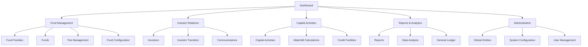

# StratCap Professional UI/UX Architecture

## Executive Summary

This document outlines the comprehensive professional layout and UI/UX architecture for the StratCap application, transforming the existing Material-UI foundation into a world-class financial platform interface that follows modern design principles and accessibility standards.

## Current State Analysis

### ✅ Existing Strengths
- **Material-UI Foundation**: Solid component library with professional theming
- **TypeScript Implementation**: Type-safe development environment
- **Routing Structure**: Well-organized protected routes with clear hierarchy
- **Component Organization**: Logical separation of concerns across 20+ feature areas
- **Theme System**: Professional color palette and typography already established

### 🔄 Areas for Enhancement
- **Layout Consistency**: Standardize page layouts across all modules
- **Responsive Design**: Enhance mobile and tablet experiences
- **Visual Hierarchy**: Improve information density and scanning patterns
- **Accessibility**: Implement WCAG 2.1 AA compliance
- **Performance**: Optimize loading states and transitions

## Professional Layout Architecture

### 1. Design System Foundation

#### Color System Enhancement
```typescript
// Enhanced Professional Color Palette
const colorSystem = {
  // Primary Brand Colors
  primary: {
    50: '#eef2ff',    // Lightest accent
    100: '#e0e7ff',   // Light accent
    200: '#c7d2fe',   // Medium light
    300: '#a5b4fc',   // Medium
    400: '#818cf8',   // Medium dark
    500: '#1e3a8a',   // Primary brand
    600: '#1e40af',   // Dark brand
    700: '#1d4ed8',   // Darker
    800: '#1e3a8a',   // Darkest
    900: '#1e293b',   // Near black
  },
  
  // Semantic Colors
  semantic: {
    success: '#10b981',
    warning: '#f59e0b', 
    error: '#ef4444',
    info: '#3b82f6',
  },
  
  // Neutral Grays
  neutral: {
    0: '#ffffff',
    50: '#f8fafc',
    100: '#f1f5f9',
    200: '#e2e8f0',
    300: '#cbd5e1',
    400: '#94a3b8',
    500: '#64748b',
    600: '#475569',
    700: '#334155',
    800: '#1e293b',
    900: '#0f172a',
  }
};
```

#### Typography Scale
```typescript
const typographyScale = {
  // Display Typography (Marketing/Hero sections)
  display: {
    xl: { size: '4.5rem', lineHeight: 1.1, weight: 700 },
    lg: { size: '3.75rem', lineHeight: 1.1, weight: 700 },
    md: { size: '3rem', lineHeight: 1.2, weight: 600 },
    sm: { size: '2.25rem', lineHeight: 1.3, weight: 600 },
  },
  
  // Heading Typography (Content hierarchy)
  heading: {
    h1: { size: '2rem', lineHeight: 1.3, weight: 600 },
    h2: { size: '1.5rem', lineHeight: 1.4, weight: 600 },
    h3: { size: '1.25rem', lineHeight: 1.4, weight: 600 },
    h4: { size: '1.125rem', lineHeight: 1.5, weight: 500 },
    h5: { size: '1rem', lineHeight: 1.5, weight: 500 },
    h6: { size: '0.875rem', lineHeight: 1.5, weight: 500 },
  },
  
  // Body Typography
  body: {
    xl: { size: '1.25rem', lineHeight: 1.6, weight: 400 },
    lg: { size: '1.125rem', lineHeight: 1.6, weight: 400 },
    md: { size: '1rem', lineHeight: 1.6, weight: 400 },
    sm: { size: '0.875rem', lineHeight: 1.5, weight: 400 },
    xs: { size: '0.75rem', lineHeight: 1.4, weight: 400 },
  }
};
```

### 2. Responsive Grid System

#### Breakpoint System
```typescript
const breakpoints = {
  xs: '0px',      // Mobile portrait
  sm: '600px',    // Mobile landscape
  md: '960px',    // Tablet
  lg: '1280px',   // Desktop
  xl: '1920px',   // Large desktop
};

const containerSizes = {
  xs: '100%',
  sm: '540px',
  md: '720px', 
  lg: '960px',
  xl: '1140px',
};
```

#### Layout Grid Specifications
- **Desktop (≥1280px)**: 12-column grid, 24px gutters, max-width 1200px
- **Tablet (960px-1279px)**: 8-column grid, 20px gutters, max-width 100%
- **Mobile (≤959px)**: 4-column grid, 16px gutters, max-width 100%

### 3. Component Hierarchy & Standards

#### Page Layout Templates

##### 1. Dashboard Template
```typescript
interface DashboardPageProps {
  title: string;
  subtitle?: string;
  actions?: React.ReactNode;
  metrics?: MetricCard[];
  children: React.ReactNode;
}
```

**Structure**:
- Page header with title, subtitle, and action buttons
- Metrics row (KPI cards)
- Main content area with responsive grid
- Consistent padding and spacing

##### 2. List Template
```typescript
interface ListPageProps {
  title: string;
  subtitle?: string;
  searchable?: boolean;
  filterable?: boolean;
  actions?: ActionButton[];
  data: any[];
  columns: TableColumn[];
}
```

**Features**:
- Search and filter controls
- Sortable table headers
- Pagination controls
- Bulk actions support
- Empty state handling

##### 3. Form Template
```typescript
interface FormPageProps {
  title: string;
  subtitle?: string;
  sections: FormSection[];
  validationSchema: any;
  onSubmit: (data: any) => void;
  loading?: boolean;
}
```

**Structure**:
- Progress indicator for multi-step forms
- Section-based organization
- Sticky action bar
- Auto-save capabilities
- Validation feedback

##### 4. Detail Template
```typescript
interface DetailPageProps {
  title: string;
  subtitle?: string;
  breadcrumbs: Breadcrumb[];
  tabs?: TabConfiguration[];
  actions?: ActionButton[];
  children: React.ReactNode;
}
```

**Features**:
- Breadcrumb navigation
- Tabbed content organization
- Action dropdown menus
- Related content sidebars

### 4. Navigation Architecture

#### Primary Navigation Structure


#### Sidebar Enhancement Specifications
- **Collapsed State**: 64px width, icon-only display
- **Expanded State**: 280px width, icon + text display
- **Hover Tooltips**: On collapsed icons for accessibility
- **Active State**: Visual indication with accent color
- **Grouping**: Related items visually grouped
- **Search**: Quick navigation search functionality

### 5. Component Standards

#### Card Components
```typescript
// Standard Card Variants
interface CardProps {
  variant: 'elevation' | 'outlined' | 'filled';
  size: 'sm' | 'md' | 'lg';
  padding: 'none' | 'sm' | 'md' | 'lg';
  hover?: boolean;
  loading?: boolean;
}
```

#### Button System
```typescript
// Comprehensive Button System
interface ButtonProps {
  variant: 'primary' | 'secondary' | 'ghost' | 'danger';
  size: 'xs' | 'sm' | 'md' | 'lg';
  fullWidth?: boolean;
  loading?: boolean;
  leftIcon?: React.ReactNode;
  rightIcon?: React.ReactNode;
}
```

#### Form Controls
```typescript
// Standardized Form Components
interface FormControlProps {
  label: string;
  required?: boolean;
  error?: string;
  helper?: string;
  disabled?: boolean;
  size: 'sm' | 'md' | 'lg';
}
```

### 6. Spacing & Layout Standards

#### Spacing Scale
```scss
$spacing-scale: (
  0: 0,
  1: 0.25rem,  // 4px
  2: 0.5rem,   // 8px
  3: 0.75rem,  // 12px
  4: 1rem,     // 16px
  5: 1.25rem,  // 20px
  6: 1.5rem,   // 24px
  8: 2rem,     // 32px
  10: 2.5rem,  // 40px
  12: 3rem,    // 48px
  16: 4rem,    // 64px
  20: 5rem,    // 80px
  24: 6rem,    // 96px
);
```

#### Layout Spacing Rules
- **Page margins**: 24px on mobile, 32px on tablet, 40px on desktop
- **Card padding**: 16px (sm), 24px (md), 32px (lg)
- **Form spacing**: 24px between sections, 16px between fields
- **Button spacing**: 8px between related buttons, 16px between groups

### 7. Loading States & Transitions

#### Loading State Patterns
```typescript
// Skeleton Loading Components
interface SkeletonProps {
  variant: 'text' | 'rectangular' | 'circular';
  width?: string | number;
  height?: string | number;
  animation?: 'pulse' | 'wave' | false;
}
```

#### Animation Standards
- **Page transitions**: 200ms ease-in-out
- **Component hover**: 150ms ease-out
- **Loading states**: Subtle pulse animation
- **Form validation**: Smooth color transitions

### 8. Error Handling & Feedback

#### Error State Templates
```typescript
interface ErrorBoundaryProps {
  fallback?: React.ReactNode;
  onError?: (error: Error) => void;
  level: 'page' | 'component' | 'inline';
}
```

#### Feedback Patterns
- **Success**: Green accent with checkmark icon
- **Warning**: Amber accent with warning icon  
- **Error**: Red accent with error icon
- **Info**: Blue accent with info icon

### 9. Accessibility Standards (WCAG 2.1 AA)

#### Focus Management
- Visible focus indicators on all interactive elements
- Logical tab order throughout the application
- Skip links for keyboard navigation
- Focus trapping in modals and dropdowns

#### Color & Contrast
- Minimum 4.5:1 contrast ratio for normal text
- Minimum 3:1 contrast ratio for large text
- Color not the only indicator of state/information
- High contrast mode support

#### Screen Reader Support
- Semantic HTML structure
- Proper heading hierarchy (h1 → h6)
- ARIA labels and descriptions
- Live regions for dynamic content

### 10. Performance Optimization

#### Code Splitting Strategy
```typescript
// Route-based code splitting
const LazyDashboard = lazy(() => import('./components/Dashboard'));
const LazyFunds = lazy(() => import('./pages/Funds'));
```

#### Optimization Techniques
- **Image optimization**: WebP format with fallbacks
- **Bundle splitting**: Separate vendor and application bundles
- **Tree shaking**: Remove unused code
- **Memoization**: React.memo for expensive components

## Implementation Roadmap

### Phase 1: Foundation (Weeks 1-2)
1. ✅ Enhanced theme system implementation
2. ✅ Responsive grid system setup
3. ✅ Base component standardization
4. ✅ Typography system enhancement

### Phase 2: Layout Templates (Weeks 3-4)
1. 🔄 Dashboard template creation
2. 🔄 List page template
3. 🔄 Form template system
4. 🔄 Detail page template

### Phase 3: Component Enhancement (Weeks 5-6)
1. ⏳ Navigation system upgrade
2. ⏳ Loading states implementation
3. ⏳ Error handling enhancement
4. ⏳ Accessibility improvements

### Phase 4: Polish & Optimization (Week 7)
1. ⏳ Performance optimization
2. ⏳ Final accessibility audit
3. ⏳ Cross-browser testing
4. ⏳ Documentation completion

## Success Metrics

### User Experience Metrics
- **Task completion rate**: >95%
- **Time to complete common tasks**: <30% reduction
- **User satisfaction scores**: >4.5/5
- **Support ticket reduction**: >40%

### Technical Metrics
- **Page load times**: <2 seconds
- **Accessibility score**: WCAG 2.1 AA compliant
- **Cross-browser compatibility**: >99%
- **Mobile responsiveness**: All breakpoints

### Business Metrics
- **User engagement**: >25% increase
- **Feature adoption**: >30% increase
- **Training time**: >50% reduction
- **Error rates**: >60% reduction

## Maintenance & Evolution

### Design System Governance
- **Component library documentation**: Storybook implementation
- **Design tokens**: Centralized theme management
- **Version control**: Semantic versioning for design updates
- **Testing**: Automated visual regression testing

### Continuous Improvement
- **User feedback loops**: Regular UX research sessions
- **Analytics monitoring**: User behavior tracking
- **A/B testing**: Feature optimization
- **Performance monitoring**: Core Web Vitals tracking

---

*This architecture document serves as the blueprint for transforming StratCap into a world-class financial platform with exceptional user experience and professional presentation.*