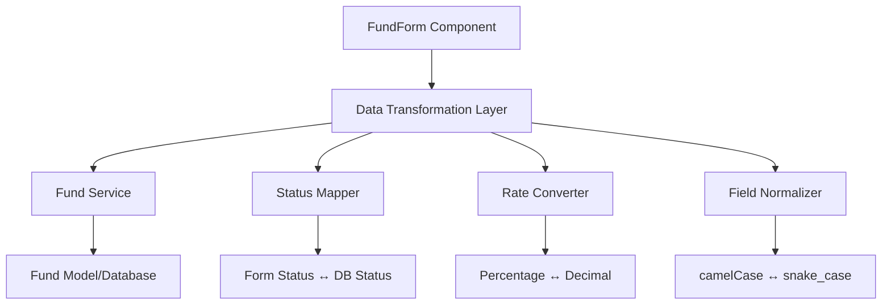

# Fund Type Compatibility Architecture

## Problem Statement

The FundForm component has several incompatibilities with the database schema that prevent proper fund creation and editing:

1. **Fund Status Enum Mismatch**
2. **Database Column Naming Inconsistencies** 
3. **Rate Field Storage Format Issues**

## Architectural Solution

### 1. Data Transformation Layer



### 2. Status Mapping Strategy

#### Form-to-Database Status Mapping
```typescript
const STATUS_MAPPING = {
  // Form Status → Database Status
  'fundraising': 'active',
  'investing': 'active', 
  'harvesting': 'liquidating',
  'closed': 'closed'
};

const REVERSE_STATUS_MAPPING = {
  // Database Status → Form Status
  'active': 'fundraising', // Default mapping
  'closed': 'closed',
  'liquidating': 'harvesting',
  'fully_realized': 'closed'
};
```

### 3. Rate Conversion Layer

#### Percentage-Decimal Conversion
```typescript
class RateConverter {
  static toDatabase(percentage: string): string {
    return (parseFloat(percentage) / 100).toString();
  }
  
  static fromDatabase(decimal: string): string {
    return (parseFloat(decimal) * 100).toString();
  }
}
```

### 4. Field Normalization

#### Column Name Mapping
```typescript
const FIELD_MAPPING = {
  // Model Field → Database Column
  'fundFamilyId': 'fund_family_id',
  'managementFeeRate': 'management_fee_rate',
  'carriedInterestRate': 'carried_interest_rate',
  'preferredReturnRate': 'preferred_return_rate'
};
```

## Implementation Strategy

### Phase 1: Database Schema Alignment
1. **Update fund_status enum** to match form expectations
2. **Standardize column naming** convention (prefer camelCase)
3. **Verify rate field precision** for percentage storage

### Phase 2: Service Layer Enhancement
1. **Create FundTransformationService** for data mapping
2. **Implement StatusMapper** for status conversion
3. **Add RateConverter** for percentage handling

### Phase 3: Model Updates
1. **Update Fund model** with proper getters/setters
2. **Add validation** for status transitions
3. **Enhance error handling** for conversion failures

## Database Migration Required

```sql
-- Update fund status enum to match form expectations
ALTER TYPE fund_status RENAME TO fund_status_old;
CREATE TYPE fund_status AS ENUM ('fundraising', 'investing', 'harvesting', 'closed');

-- Migrate existing data
UPDATE funds SET status = CASE 
  WHEN status = 'active' THEN 'fundraising'
  WHEN status = 'liquidating' THEN 'harvesting' 
  WHEN status = 'fully_realized' THEN 'closed'
  ELSE status
END;

-- Apply new enum type
ALTER TABLE funds ALTER COLUMN status TYPE fund_status USING status::text::fund_status;
DROP TYPE fund_status_old;
```

## Quality Attributes

- **Consistency**: Unified data representation across layers
- **Maintainability**: Clear separation of transformation logic
- **Reliability**: Type-safe conversions with validation
- **Performance**: Minimal overhead for data transformations

## Integration Points

1. **FundForm ↔ FundService**: Data transformation layer
2. **FundService ↔ Database**: Model mapping layer  
3. **API Controllers**: Validation and error handling
4. **Database Functions**: Updated parameter expectations

## Risk Mitigation

- **Backward Compatibility**: Maintain existing API contracts
- **Data Integrity**: Validate all transformations
- **Error Recovery**: Graceful handling of conversion failures
- **Testing Strategy**: Comprehensive unit and integration tests
